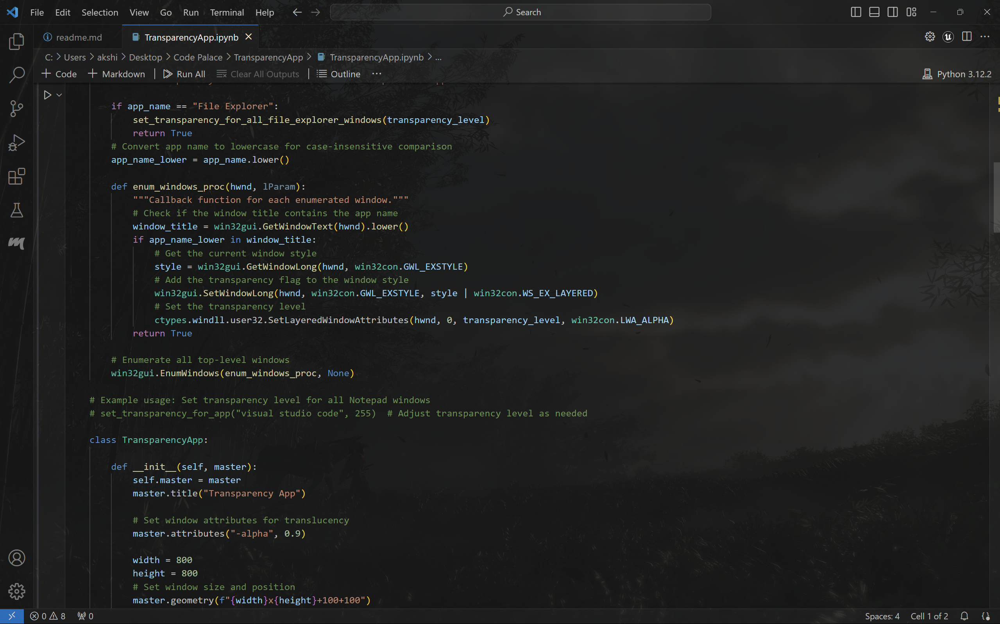
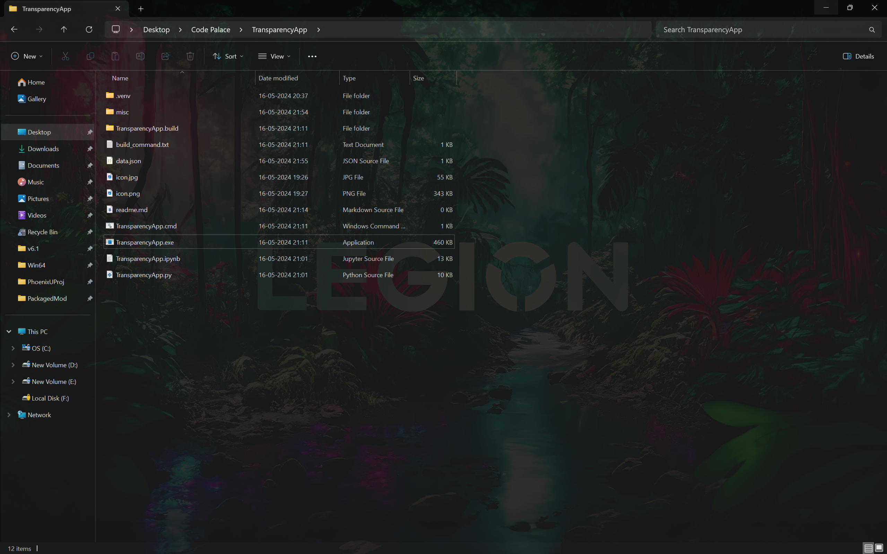

# Transparency App

This app let's you select which apps/windows you want to be transparent with a slider from 0(invisible) to 255(normal). Use the windows list dropdown to see all the currently open windows, then for example if in the list you see a name "helloworld.py - Visual Studio Code" , you can then type "visual studio code" in the textbox below and press enter and it will create a slider with 255 default value, change it to something like 230 or 240 and it will make all the visual studio code windows transparent, including ones you open later on after minimising the transparency app to tray. When you close the app it get's minimised to tray, right click on the icon in the tray and select quit to stop the app. From the GitHub repository copy TransparencyApp.exe, data.json, icon.jpg, icon.png to the same folder. Double click TransparencyApp.exe whenever you want to use it, to make it run on startup copy it's shortcut to the startup folder(you can find tutorials online on how to make apps run on startup). It needs python 3.12 on the system. 

