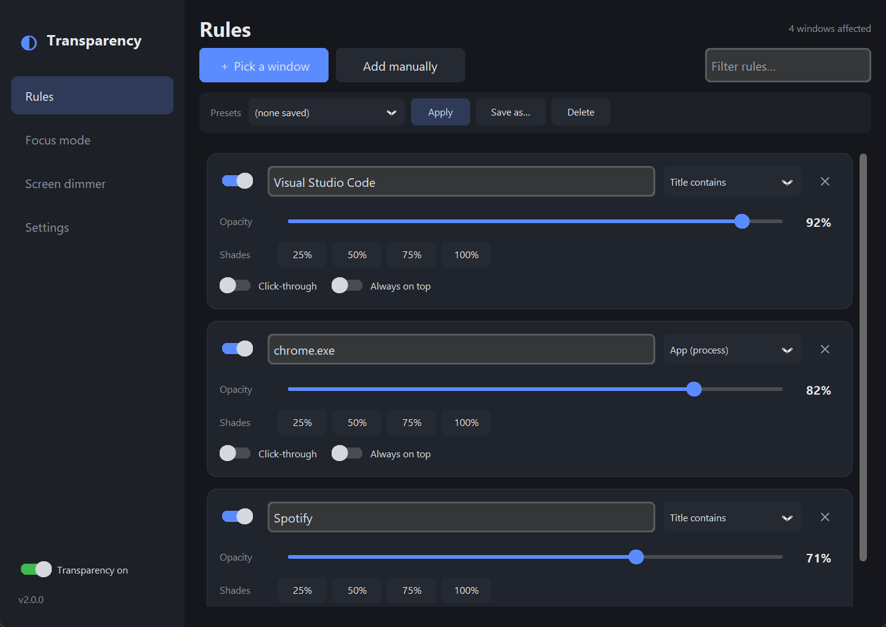

<h1 align="center">Transparency App</h1>

<p align="center">
  Make any window on Windows see-through — per app, with a slider.
</p>

<p align="center">
  <a href="https://github.com/AkshitIreddy/TransparencyApp/releases/latest"></a>
  
  
</p>

<p align="center">
  
</p>

## What it is

Transparency App is a lightweight tray utility that lets you set the opacity of
other applications' windows. Want your code editor at 90% so you can read a
video behind it, keep a chat window ghosted over your work, or dim everything
except what you're focused on? Add a rule, drag a slider, done. Rules keep
working for windows you open later, and the app sits quietly in your system
tray.

## Highlights

- 🪟 **Per-app transparency rules** — match by window title or by application,
  each with its own opacity.
- 🎯 **Pick a window** — click one of your open windows instead of guessing its
  exact title.
- 🎚️ **Quick shades** — one-tap 25 / 50 / 75 / 100 %.
- 🗂️ **Presets** — save rule sets and switch between them (Work, Gaming, …).
- 🫥 **Focus mode** — dim every window except the one you're using; it follows
  your focus automatically.
- 🌒 **Per-monitor screen dimmer** — set a different click-through dimming
  level for every display, or leave selected screens unchanged. The overlay is
  automatically left out of Snipping Tool screenshots and screen captures.
- ⌨️ **Global hotkeys** — toggle transparency/focus, nudge opacity, or restore
  everything with one keystroke. Every shortcut is remappable in Settings.
- 🖱️ **Per-rule click-through & always-on-top.**
- 🚀 **Run at startup**, 💾 **import/export settings**, 🌗 **dark/light theme**,
  🎨 **seven accent colours.**

## Install

1. Download **`TransparencyApp.exe`** from the
   [latest release](https://github.com/AkshitIreddy/TransparencyApp/releases/latest).
2. Double-click it to run. That's it — no installer, no admin rights.
3. (Optional) Turn on **Settings → Start with Windows** to launch at sign-in.

After installation, the app checks GitHub Releases in the background. New
versions are downloaded, SHA-256 verified, and installed after you approve the
restart. You can also use **Settings → Updates → Check now** at any time.

> Windows SmartScreen may warn about a new unsigned app. Choose
> **More info → Run anyway**. The full source is in this repo and the
> executable is built in the open by
> [GitHub Actions](.github/workflows/release.yml).

## Quick start

1. Click **＋ Pick a window** and choose an open window.
2. Drag its **Opacity** slider down.
3. Minimise to the tray — the rule keeps working in the background.

The full guide is in **[docs/USAGE.md](docs/USAGE.md)**.

### Hotkeys

All remappable in **Settings → Keyboard shortcuts**. Defaults:

| Shortcut | Action |
| --- | --- |
| `Ctrl+Alt+T` | Toggle all transparency |
| `Ctrl+Alt+F` | Toggle focus mode |
| `Ctrl+Alt+↑` / `↓` | Focused window more / less opaque |
| `Ctrl+Alt+Home` | Restore every window (panic) |

## How it works

Windows exposes per-window opacity through *layered windows*
(`SetLayeredWindowAttributes`). Transparency App watches the system for window
events (a window opening, showing, being renamed, or gaining focus) via
`SetWinEventHook` and applies your rules only when something actually changes —
so it costs almost nothing while idle, unlike a polling loop. A single worker
thread owns all the Win32 calls, every window's original state is recorded so
it can be restored exactly, and if the app is ever killed it cleans up on the
next launch.

## Build from source

Windows-only, Python 3.12:

```powershell
python -m venv .venv
.venv\Scripts\activate
pip install -r requirements-dev.txt
python -m transparency_app          # run from source
pyinstaller --clean --noconfirm TransparencyApp.spec   # build the exe
```

See **[docs/BUILDING.md](docs/BUILDING.md)** for the test suite, project
layout, and release process.

## Contributing

Issues and pull requests are welcome. Please run the tests
(`powershell -File scripts\run_tests.ps1`) before opening a PR. Changes are
tracked in **[CHANGELOG.md](CHANGELOG.md)**.

## License

Released under the [MIT License](LICENSE).
